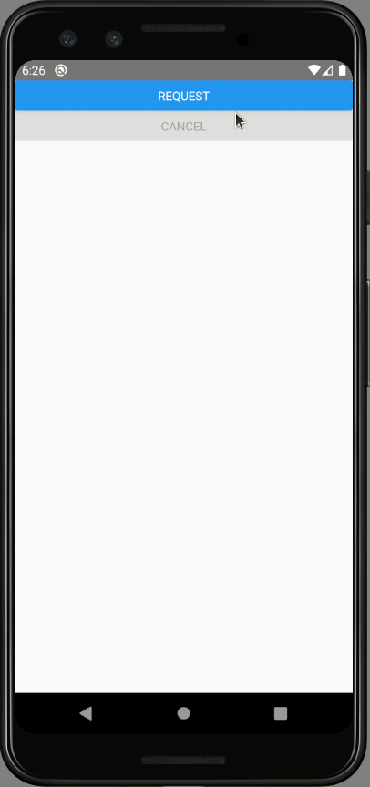
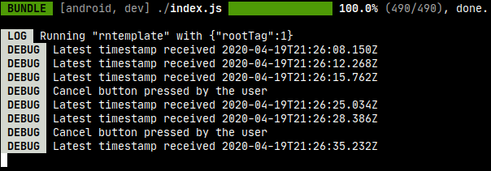

# POC: Axios Cancel

It demonstrates how to cancel HTTP requests using [Axios](https://github.com/axios/axios).

## How to run

| Description | Command |
| :--- | :--- |
| Install dependencies | `npm install` |
| Run tests | `npm test` |
| Start Metro | `npm start` |
| Run app | `npm run android` |

## Preview

